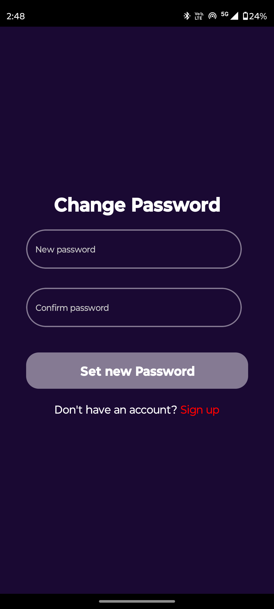

# App_Book_Library

# Project Setup Instructions

# Backend Setup
### 2. MongoDB Setup
- **Install Mongoose:**  
  `npm install mongoose`

### 3. Express.js Setup
- **Install Express.js:**  
  `npm install express`

### 4. Starting the Backend
- **Install All Dependencies:**  
  `npm install`

- **Start the Backend Server:**  
  `npm start`

### 5. Authentication Setup
- **Install JSON Web Token (JWT):**  
  `npm install jsonwebtoken`


- **Set Token Expiration:**  
  The login token will expire after 2 days.

### 6. Forgot Password Implementation
- **Use Nodemailer for Sending Emails:**  
  Implement the backend to use Nodemailer for sending a verification email when the user forgets their password. The user should be able to verify their email and set a new password.

- **Redirect After Password Reset:**  
  After setting the new password, the user should be redirected back to the sign-in page to log in with the new password.

---
## Frontend Setup

### Project Name: App Book

- **Framework:** React Native
- **Language:** TypeScript
### 1. Install React Native CLI
```bash
 npm install -g react-native-cli
 npx react-native init BookApp --template react-native-template-typescript
 // React Navigation
 npm install @react-navigation/native @react-navigation/stack
npm install react-native-gesture-handler react-native-reanimated react-native-screens react-native-safe-area-context @react-native-community/masked-view

// Axios for API Requests
npm install axios
// Icons
npm install @expo/vector-icons
```

 -**Demo**
<div style="display: flex; flex-wrap: wrap; gap: 10px;padding:20;justify-content:space-between">
  
  
  
  
  
  
  
  
  
  
  
</div>

### 2. Starting the Frontend
- **Install All Dependencies:**  
  `npm install`

- **Start the React Native:**  
  `npm start`
